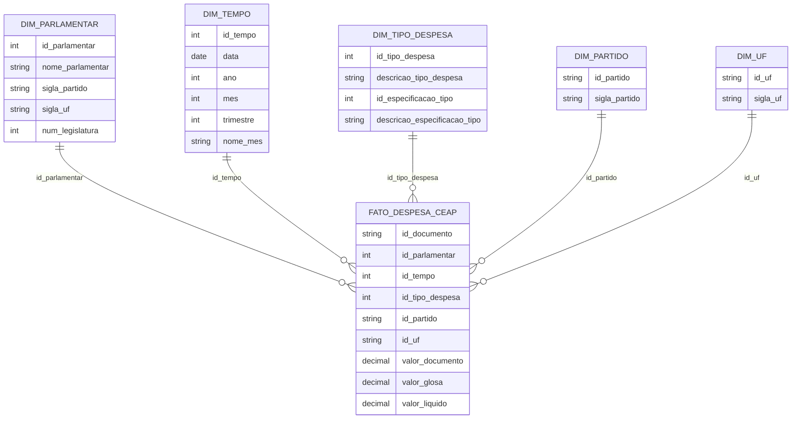

# MVP Engenharia de Dados:
## Transparência e análise de gastos públicos - CEAP

Este repositório contém o **MVP da Sprint de Engenharia de Dados** da turma de **Especialização em Ciência de Dados e Analytics — PUC-Rio**, utilizando dados públicos e abertos da **Cota para o Exercício da Atividade Parlamentar (CEAP)** para criar um pipeline de ponta a ponta, para análises precisas baseadas em dados:
>##### `(busca → coleta → modelagem → carga → análise)`

- **Tema:** Transparência e análise de gastos públicos (CEAP)  
- **Plataforma:** Databricks Free Edition (Delta Lake + Spark + SQL + Dashboards)  
- **Arquitetura:** Medallion (Staging → Bronze → Silver → Gold)  
- **Linguagens:** Python (via PySpark) + SQL  
- **Modelo analítico:** Esquema Estrela (Star Schema)  
- **Entrega:** Repositório GitHub com notebooks, documentação e evidências visuais


---
## Índice

- [Objetivo](#objetivo)
    - [Escopo do MVP](#escopo-do-mvp)
    - [Contexto e Problema a ser resolvido](#contexto-e-problema-a-ser-resolvido)
- [Fonte de dados, Catálogo e Linhagem](#fonte-de-dados-catálogo-e-linhagem)
- [Arquitetura da Solução](#arquitetura-da-solução)
- [Preparação do ambiente (Databricks)](#preparação-do-ambiente-databricks)
- [Etapas do Pipeline ETL](#etapas-do-pipeline-etl)
- [Modelo de dados](#modelo-de-dados)
- [Análises (SQL) — Respostas às perguntas do MVP](#análises-sql--respostas-às-perguntas-do-mvp)
- [Autoavaliação](#autoavaliação)
- [Organização do repositório e Estrutura do Projeto](#organização-do-repositório-e-estrutura-do-projeto)
- [Execução do Projeto](#execução-do-projeto)

---

### Objetivo

#### Escopo do MVP  

Este projeto contempla:
- A coleta e armazenamento dos dados oficiais da CEAP.
- A construção de um pipeline de dados seguindo a arquitetura Medallion.
- A modelagem dos dados em formato analítico, **Esquema Estrela** (fato + dimensões).
- A análise e avaliação de **qualidade de dados**.
- A resposta às perguntas de negócio por meio de SQL no Databricks, complementada por visualizações analíticas

#### Contexto e Problema a ser resolvido

A **Cota para o Exercício da Atividade Parlamentar (CEAP)** representa uma parcela significativa dos gastos públicos destinados ao funcionamento do Poder Legislativo. Apesar de os dados serem públicos, seu volume, granularidade e formato dificultam análises consolidadas que permitam avaliar padrões de gastos, identificar concentrações relevantes e compreender a distribuição dos recursos ao longo do tempo, por partido político e por tipo de despesa.

Diante desse contexto, este MVP tem como objetivo construir um pipeline de dados em nuvem, utilizando a plataforma Databricks Free Edition, capaz de coletar, modelar, transformar e analisar os dados da CEAP, gerando informações analíticas que apoiem a transparência pública e a tomada de decisão baseada em dados.


---

### Fonte de dados, Catálogo e Linhagem
Notebook: [10_catálogo-de-dados](https://github.com/matheusd09/mvp-engdados-ceap/blob/main/10_catalogo-de-dados.md)  

Os dados utilizados neste projeto são provenientes da Cota para o Exercício da Atividade Parlamentar (CEAP), disponibilizados publicamente pela Câmara dos Deputados por meio do Portal da Transparência.  
Os dados foram obtidos em formato CSV.zip e referem-se ao ano de 2024.

O catálogo documenta:
- Fonte e links oficiais
- Frequência de atualização
- Linhagem (Staging → Bronze → Silver → Gold)
- Descrição das tabelas (fato e dimensões)
- Tipos e domínios esperados

>Informações detalhadas no [Catálogo de Dados](https://github.com/matheusd09/mvp-engdados-ceap/blob/main/10_catalogo-de-dados.md)

---

### Arquitetura da Solução

O pipeline segue uma arquitetura em camadas conhecida como **Arquitetura Medallion**:

- **Staging**: Download + extração + armazenamento do arquivo original (zip) e extraído (csv) em um Volume do Unity Catalog.
- **Bronze**: Ingestão dos dados **crus**, preservando a granularidade original.
- **Silver**: Limpeza, padronização textual, conversão de tipos (datas, decimais), criação de campos auxiliares e checagens de qualidade.
- **Gold**: Modelagem analítica em **Esquema Estrela** para consultas simples e consistentes.


---

### Preparação do ambiente (Databricks)

#### Estrutura (Catalog e Schemas)

O notebook [01_preparacao](https://github.com/matheusd09/mvp-engdados-ceap/blob/main/01_preparacao.ipynb) cria os **catalogs** e **schemas** do projeto:

- `staging`
- `layer_bronze`
- `layer_silver`
- `layer_gold`

> Observação: por simplicidade de reprodução, o script remove e recria o catálogo.


---

## Etapas do Pipeline ETL

### Staging — Download e extração do dataset
Notebook: [02_staging-ceap](https://github.com/matheusd09/mvp-engdados-ceap/blob/main/02_staging-ceap.ipynb)

- Cria um **Volume** em `mvp_ed_ceap.staging.staging_data`
- Baixa o `.zip` diretamente da Câmara (`dbutils.fs.cp`)
- Lê o binário e extrai o `.csv`
- Persiste `.zip` e `.csv` no Volume para rastreabilidade
- Evidências nos outputs do Notebook.  


-------------------------
### Bronze — Ingestão “as-is”
Notebook: [03_bronze-layer](https://github.com/matheusd09/mvp-engdados-ceap/blob/main/03_bronze-layer.ipynb)

- Lê o CSV com `sep=';'`, `header=True`, sem inferência de schema
- Persiste em Delta como tabela `layer_bronze.bronze_ceap_despesas`


### Silver — Tratamento, tipagem e qualidade
Notebook: [04_silver-layer](https://github.com/matheusd09/mvp-engdados-ceap/blob/main/04_silver-layer.ipynb)

Principais transformações:
- Renomeação de colunas (padronização semântica)
- Padronização textual (`trim`, `upper`)
- Conversão de datas ISO → `date` (`to_date`)
- Conversão de valores monetários → `decimal(12,2)`
- Conversão de chaves numéricas → `int`
- Normalização de documento CNPJ/CPF apenas dígitos (`regexp_replace`)
- Remoção de colunas `_raw` que foram utilizadas para validar as conversões

Saída: tabela `layer_silver.silver_ceap_despesas`

**Checagens de qualidade incluídas:**
- Completude (nulos em campos críticos e opcionais)
- Consistência de valores (negativos, liquido > documento)
- Estatísticas (min/mediana/média/máximo)
- Duplicidade lógica (chave: `id_documento`, `id_parlamentar`, `data_emissao`)
- Consistência temporal (`ano_ref` vs `year(data_emissao)`)
- Domínio categórico (tipos de despesa, UF)

> Importante: no MVP, outliers e duplicidades **são identificados**, mas fazem parte das análises e não necessariamente removidos (decisão documentada).

### Gold — Modelo analítico (Esquema Estrela)
Notebook: [05_gold-layer](https://github.com/matheusd09/mvp-engdados-ceap/blob/main/05_gold-layer.ipynb)

**Tabela Fato:**  
  **`fato_despesa_ceap`**   

>> A tabela fato inclui:
>> - `id_documento` (identificador do documento)
>> - FKs para dimensões (`id_parlamentar`, `id_tempo`, `id_tipo_despesa`, `id_partido`, `id_uf`)
>> - Métricas monetárias (`valor_documento`, `valor_glosa`, `valor_liquido`)

**Dimensões**: 
- **`dim_parlamentar`**
- **`dim_tempo`**
- **`dim_tipo_despesa`**
- **`dim_partido`**
- **`dim_uf`**

---

### Modelo de dados

O modelo segue um **Esquema Estrela** (Star Schema), com uma tabela fato central e dimensões descritivas.



---

## Análises (SQL) — Respostas às perguntas do MVP

Notebook Perguntas e Respostas: [06_Q&A](https://github.com/matheusd09/mvp-engdados-ceap/blob/main/06_Q%26A.ipynb)  
Dashboards: [Databricks Dashboard-Json](https://github.com/matheusd09/mvp-engdados-ceap/blob/main/Dashboards/06_Q%26A_Dashboards.lvdash.json)  
Dashboards: [Markdown](https://github.com/matheusd09/mvp-engdados-ceap/blob/main/Dashboards/06_Q%26A_Dashboards.md)  
Dashboards: [Prints](https://github.com/matheusd09/mvp-engdados-ceap/tree/main/Dashboards)  

**Consultas implementadas:**
- Total de gastos no período
- Gasto médio por parlamentar
- Distribuição mensal (ano/mês)
- Ranking de gastos por parlamentares
- Variação de gasto (min/max/média por parlamentar)
- Gastos por tipo de despesa
- Gasto médio por partido
- Composição de gasto por partido × tipo
- Gastos por UF
- Meses com maiores gastos (picos)

---

## Autoavaliação

Notebook: [11_Auto_avaliacao](https://github.com/matheusd09/mvp-engdados-ceap/blob/main/11_Auto_avaliacao.md)

---

## Organização do repositório e Estrutura do Projeto

```
mvp-engdados-ceap/
├── README.md                             # Descrição geral do projeto
│
├── .databricks/                         # Metadados internos do Databricks
│   └── commit_outputs/                  # Saídas automáticas de commits
│
├── 01_preparacao.ipynb                  # Preparação do ambiente e schemas
├── 02_staging-ceap.ipynb                # Ingestão do CSV para área de staging
├── 03_bronze-layer.ipynb                # Persistência dos dados brutos (Bronze)
├── 04_silver-layer.ipynb                # Tratamento técnico e padronização (Silver)
├── 05_gold-layer.ipynb                  # Camada analítica para consumo (Gold)
├── 06_Q&A.ipynb                         # Consultas analíticas e respostas de negócio
├── 10_catalogo-de-dados.md              # Catálogo oficial de dados
├── 11_Auto_avaliacao.md                 # Auto avaliação
│
├── Dashboards/                          # Evidências visuais das análises
│   ├──06_Q&A_Dashboards.lvdash.json     # Definição dos dashboards no Databricks
│   └──06_Q&A_Dashboards.md              # Prints dos dashboards
│
├── Documentos/                          # Documentação e evidências técnicas
│   ├── Diagrama.png                     # Diagrama da modelagem de dados
│   ├── Volumes_e_Schemas.png            # Evidência de volumes e schemas
│   ├── medallion_architecture.png       # Arquitetura Medallion do projeto
│   └── staging_volume.png               # Evidência da área de staging
│
├── Referencias/                         # Dados de referência
    └── Ano-2024.csv                     # Dataset original da CEAP
```
Arquivos principais:
- [README.md](https://github.com/matheusd09/mvp-engdados-ceap/blob/main/README.md) — Estrutura do Projeto
- [01_preparacao.ipynb](https://github.com/matheusd09/mvp-engdados-ceap/blob/main/01_preparacao.ipynb) — Criação de catalog e schemas
- [02_staging-ceap.ipynb](https://github.com/matheusd09/mvp-engdados-ceap/blob/main/02_staging-ceap.ipynb) — Staging (download/extract)
- [03_bronze-layer.ipynb](https://github.com/matheusd09/mvp-engdados-ceap/blob/main/03_bronze-layer.ipynb) — Ingestão Bronze
- [04_silver-layer.ipynb](https://github.com/matheusd09/mvp-engdados-ceap/blob/main/04_silver-layer.ipynb) — Transformação + qualidade
- [05_gold-layer.ipynb](https://github.com/matheusd09/mvp-engdados-ceap/blob/main/05_gold-layer.ipynb) — Star schema (Gold)
- [06_Q&A.ipynb](https://github.com/matheusd09/mvp-engdados-ceap/blob/main/06_Q%26A.ipynb) — Queries de negócio
- [10_catalogo-de-dados.md](https://github.com/matheusd09/mvp-engdados-ceap/blob/main/10_catalogo-de-dados.md) — Catálogo + linhagem
- [11_Auto_avaliacao.md](https://github.com/matheusd09/mvp-engdados-ceap/blob/main/11_Auto_avaliacao.md) — Auto Avaliação
- [Documentos](https://github.com/matheusd09/mvp-engdados-ceap/tree/main/Documentos) — Documentos do MVP
- [Dashboards](https://github.com/matheusd09/mvp-engdados-ceap/tree/main/Dashboards) — Imagens dos Dashboards criados
- [Referencias](https://github.com/matheusd09/mvp-engdados-ceap/tree/main/Referencias) — Referencias e Amostras

---

## Execução do Projeto

1) Importar/abrir o repositório no Databricks  
2) Executar na ordem:

- `01_preparacao.ipynb`
- `02_staging-ceap.ipynb`
- `03_bronze-layer.ipynb`
- `04_silver-layer.ipynb`
- `05_gold-layer.ipynb`
- `06_Q&A.ipynb`

3) Criar visualizações gráficas no **Databricks Dashboards** utilizando as queries do `06_Q&A`.

---